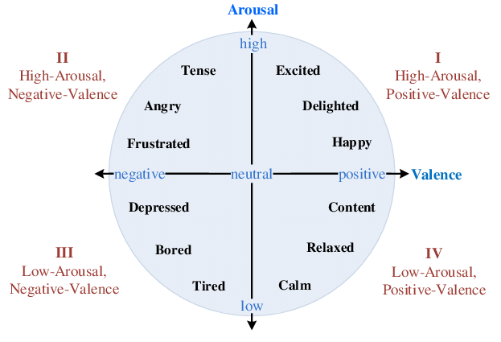

# Spotify Emotion to VRChat OSC

This is my attempt at creating a machine learning algorithm to map brainwaves to emotional response using [Spotify's emotion metadata](https://developer.spotify.com/documentation/web-api/reference/#/operations/get-audio-features), [Pytorch's machine learning library](https://pytorch.org), [Brainflow's ONNX integration](https://brainflow.org/2022-06-09-onnx/), and [VRChat OSC](https://hello.vrchat.com/blog/vrchat-osc-for-avatars).

## How it works

1. Use Spotify to find songs with various emotion metadata
2. Listen to track sections and record your eeg data through Brainflow
3. Train a machine learning algo using Pytorch
4. Export algo as an ONNX model
5. Import ONNX model using Brainflow ONNX integration
6. Use Brainflow and the ONNX model to extract emotions from yourself
7. Send your live emotion data to your avatar via VRChat OSC

## How to describe emotion

Emotion can be described as a 2D space, where the the x axis is positivity/valence of the emotion and the y axis is the energy/arousal of the emotion.
For example, relaxed can be described as a positive low energy emotion but excited can be described as a positive high energy emotion. This way of describing emotion results in two floats that can be sent to your VRChat avatar for various emotional animations.

## Getting Started

1. Install [Python](https://www.python.org/downloads/)
2. Install [Pip](https://pip.pypa.io/en/stable/installation/)
3. Install required libraries with this command: `pip install -r requirements.txt`

## Setting up Spotify for Remote Control During EEG Recording

1. Log into [Spotify Developer Dashboard](https://developer.spotify.com/dashboard/login)
2. Create an app, recording its client id and secret
3. Set the app's redirect uri to `https://open.spotify.com`
4. Follow the [Authorization Code Flow](https://spotipy.readthedocs.io/en/master/#authorization-code-flow) steps to setup authentication
5. Open your spotify client and keep it open
6. Run `python get_device_ids.py` command, following the commands to get autheticated.
7. The script will return device information. Record the device id if your chosen device
8. Get the metadata for the Spotify EEG Playlist by running `python get_spotify_metadata.py` (This will take a while, only run this once!)

## Recording EEG Data while listening to Spotify

1. Have 2 hours to spare
2. Have your Spotify Device ID handy
3. Get your EEG headband's board ID: [Supported Boards](https://brainflow.readthedocs.io/en/stable/SupportedBoards.html)
4. Turn on and wear your EEG headband
5. Run this command `python record_eeg.py --board-id BOARD_ID --spotify-device-id DEVICE_ID` , replacing `BOARD_ID` with your board ID and `DEVICE_ID` with your Spotify Device ID
6. Lay back and listen to the music. The script will automatically play sections of music at random, pausing for 5 seconds in between, and recording your brainwaves.

## Training the model

1. Make sure to have completed steps for `Recording EEG Data while listening to Spotify` 
2. Run this command: `python train.py`
3. Wait for it to finish
4. Once finished, a graph will pop up showing the error rate. It should descend over time. 
5. Close the graph. An onnx model should now be saved in the project folder

## Using the model

1. Turn on and wear your EEG headband
2. Run the script main.py with your device id: `python main.py --board-id BOARD_ID`
3. This will now start sending emotion data to VRChat OSC. This will replace the usual osc avatar paramaters. They will still have a range of [-1, 1]
   1. Emotion Energy => `/avatar/parameters/osc_relax_avg`
   2. Emotion Positivity => `/avatar/parameters/osc_focus_avg`

## Extras

1. Complete the steps above for `Training the model`
2. Run this command: `jupyter notebook`
3. Open [http://localhost:8888/notebooks/viz-and-modeling.ipynb](http://localhost:8888/notebooks/viz-and-modeling.ipynb) in a web browser
4. Run the cells in the notebook to visualize a [UMAP](https://arxiv.org/abs/1802.03426) embedding of the EEG signals in `dataset.pkl`. The notebook also contains code for training a random forest regression model, performing cross-validation, and computing training error. 

## Caveats

I suck at machine learning, so the custom machine learning model included is not performant at all. In the next coming months, I'll be updating this with the help of my more experienced friends to see where this could go. This is more proof of concept that the pipeline to add machine learning works!

## Citations
- [Valence Arousal Diagram](https://www.researchgate.net/figure/Two-dimensional-valence-arousal-space_fig1_304124018)
